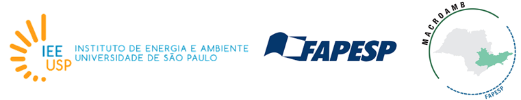
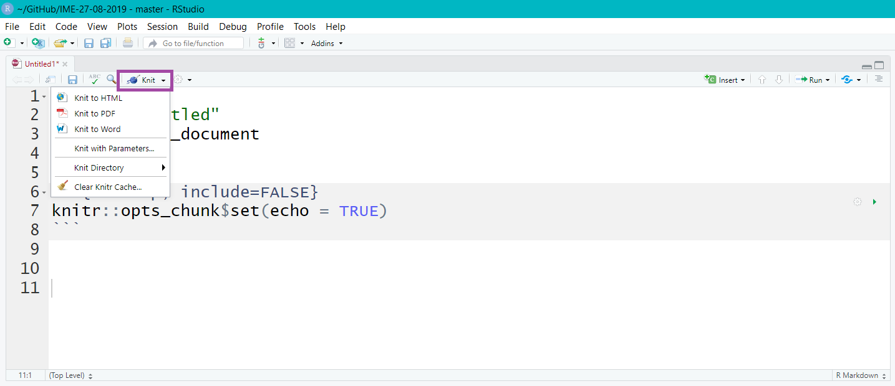

```{r setup, include=FALSE}
options(htmltools.dir.version = FALSE)

knitr::opts_chunk$set(echo = FALSE, fig.align = "center", message=FALSE, warning=FALSE, cache = TRUE)
```

# Beatriz Milz
- Doutoranda no Programa de Pós-Graduação em Ciência Ambiental (PROCAM) - Instituto de Energia e Ambiente - Universidade de São Paulo

  - Bolsita FAPESP - Processo nº 2018/23771-6 
  
  - Projeto Temático FAPESP Macroamb - Processo nº 2015/03804-9 
  
```{r, out.width="80%"}

```

- Equipe da Secretaria Executiva  Editorial - [Revista Ambiente & Sociedade](http://scielo.br/asoc)

- Co-organizadora - [R-Ladies São Paulo](https://www.meetup.com/pt-BR/R-Ladies-Sao-Paulo) `r emo::ji("purple_heart")`

- [Currículo disponível neste link](https://beatrizmilz.github.io/resume/index.pdf)

- Anteriormente:
  - Mestre em Ciências - UNIFESP
  - Bacharel em Gestão Ambiental - EACH/USP

---
class: 

# Mariana Dias Guilardi

<!------- Mari preencher aqui ------->
  
---
class: 

```{r, out.width="15%", fig.cap="<center><b>Logo - R-Ladies </center></b>"}
knitr::include_graphics("img/hexlogorladies.jpeg")
```

- R-Ladies é uma organização mundial que **promove a diversidade de gênero** na comunidade da linguagem R.

- R-Ladies São Paulo integra, orgulhosamente, a organização R-Ladies Global, em São Paulo. 

--

- [Código de conduta - R-Ladies](https://github.com/rladies/starter-kit/wiki/Code-of-Conduct#portuguese)

--

- Saiba mais:
  - Website RLadies Global: [https://rladies.org/](https://rladies.org/)
  - Twitter: [@RLadiesGlobal](https://twitter.com/rladiesglobal), [@RLadiesSaoPaulo](https://twitter.com/RLadiesSaoPaulo)
  - Instagram: [@RLadiesSaoPaulo](http://instagram.com/RLadiesSaoPaulo)
  - Facebook: [@RLadiesSaoPaulo](http://facebook.com/RLadiesSaoPaulo)
  - MeetUp: [https://www.meetup.com/pt-BR/R-Ladies-Sao-Paulo](https://www.meetup.com/pt-BR/R-Ladies-Sao-Paulo)
  - Github: [https://github.com/rladies/meetup-presentations_sao-paulo](https://github.com/rladies/meetup-presentations_sao-paulo)

---

class: middle

# Pré-requisitos

## R
- Download em: https://cran.r-project.org/

## RStudio
- Download em: https://www.rstudio.com/products/rstudio/download/

---
class: middle

# Pacote rmarkdown

```{r, out.width="25%", fig.cap="<center><b>Logo: <a href='https://rmarkdown.rstudio.com'>Pacote Rmarkdown</a></b></center>"}
knitr::include_graphics("img/rlogos/hex-rmarkdown.png")
```

- Mantido pela [RStudio](https://rstudio.com/)

- extensão `.Rmd`

- Possibilita a utilização de códigos `R`, `Markdown`, `HTML` e outros.

---
class: middle

# Pacote rmarkdown

```{r, out.width="60%", fig.cap="<center><b>Fonte: <a href='https://rmarkdown.rstudio.com'>Pacote Rmarkdown</a></b></center>"}
knitr::include_graphics("img/markdown.png")
```


---
class: middle

# Pacote xaringan

```{r, out.width="30%", fig.cap="<center><b>Logo: <a href='https://github.com/yihui/xaringan'>Pacote xaringan</a></b></center>"}
knitr::include_graphics("img/rlogos/hex-xaringan.png")
```

- Possibilita criar apresentações **ninja** com `RMarkdown`

- Utiliza a biblioteca `remark.js`

- Resultado em HTML (mas também PDF - estático)


---
class: middle

# Como usar o xaringan?

- Instalar o pacote:

```{r echo=TRUE, eval=FALSE}
install.packages("xaringan")
```

- Confira se o pacote está instalado:
```{r echo=TRUE, eval=FALSE}
library(xaringan)
```

---
class: middle

## Crie um novo projeto (Rproj)


  - File > New Project
  
  - Post da [Curso-R](https://www.curso-r.com) sobre [RProj e diretórios](https://www.curso-r.com/blog/2019-07-16-zen-do-r-3/)

---
class: middle

## Criar um arquivo rmarkdown, com template Ninja Presentation

  - File > New File > R Markdown...
  
  - New RMarkdown > From Template > Ninja presentation
  
```{r, out.width="60%"}
knitr::include_graphics("img/criar-xaringan.JPG")
```

---
class: middle

## Estrutura arquivo rmarkdown

```{r, out.width="90%"}
knitr::include_graphics("img/rmd-estrutura.png")
```

---
class: middle

## Exercício
.pull-left[
```{r, out.width="90%"}
knitr::include_graphics("https://media3.giphy.com/media/VbnUQpnihPSIgIXuZv/giphy-downsized.gif")
```
]

.pull-right[

- Criar um novo RProj 

  - File > New Project

- Criar um arquivo:

  - File > New File > R Markdown...
  
  - New RMarkdown > From Template > Ninja presentation

- Observe a estrutura do documento  

- Apagar todo o conteúdo após o código `yaml`
  
]


---
class: middle

## Compilar para html

```{r, out.width="90%"}

```


---

## Alterar yaml

- O `yaml` possui informações importantes para a apresentação, como o título, subtítulo, autor, instituição e data.

- __output:__ formato (Ex: html_document, pdf_document, etc). No caso do Xaringan, o output é `xaringan::moon_reader`

- __libs_dir:__ pasta onde colocará bibliotecas necessárias (ex. remark-latest.min.js)

- Cuidado com a identação!

```{r}
knitr::include_graphics("https://media0.giphy.com/media/xT9IgIc0lryrxvqVGM/giphy-downsized.gif")
``` 


---
class: middle

## Exercício
.pull-left[
```{r, out.width="90%"}
knitr::include_graphics("https://media0.giphy.com/media/JIX9t2j0ZTN9S/giphy-downsized.gif")
```
]

.pull-right[

- Salve o arquivo como `exercicio0.Rmd`

- Compile (botão `knit`)

- Veja o arquivo (caso não abra automaticamente, procure o arquivo `exercicio0.html` na pasta do projeto)

- Mude as seguintes informações no yaml: title, subtitle, author, institute, date

- Compile novamente. O que mudou?
  
]

---
### Exemplo do código yaml:

```{r echo=TRUE, eval=FALSE}
---
{{title: "Título da apresentação"}}
{{subtitle: "Subtítulo da apresentação"}}
{{author: "Autor"}}
{{institute: "Instituição"}}
{{date: "07/09/2019"}}
output:
  xaringan::moon_reader:
    lib_dir: libs
    nature:
      highlightStyle: github
      highlightLines: true
      countIncrementalSlides: false
---
```

---
class: middle

## Organizando a pasta

- `img/` - imagens, figuras, etc.

- `libs/` - bibliotecas. 

- `css/` - opcional. Arquivos `.css`.


---
class: middle

## Configurações no yaml

### Encoding

- Adicionar no yaml:

```{r echo=TRUE, eval=FALSE}
encoding: "UTF-8"
```


---
class: middle

## Configurações no yaml

### Biblioteca `remark.js`

- É opcional. Essa etapa possibilita que sua apresentação seja visualizada offline!


- Fazer download da biblioteca `remark.js`. Duas opções:
  - A função `xaringan::summon_remark()` faz o download da versão mais atual do `remark.js` e salva na pasta `/libs`. 
  
```{r echo=TRUE, eval=FALSE}
xaringan::summon_remark()
```

- Ou: 
```{r echo=TRUE, eval=FALSE}
download.file("https://remarkjs.com/downloads/remark-latest.min.js",
              destfile = "libs/remark-latest.min.js")
```

- Adicionar no yaml:

```{r echo=TRUE, eval=FALSE}
output:
  xaringan::moon_reader:
{{    chakra: libs/remark-latest.min.js  }}
    lib_dir: libs
```


---
class: middle

## Configurações no yaml
### Tema

- Depende da versão do Xaringan que está usando.

- Para consultar os temas disponíveis:
  
```{r echo=TRUE}
names(xaringan:::list_css())
```


---

## Configurações no yaml
### Tema


- Usar em dupla: `nomedotema` e `nomedotema-fonts`

- Adicionar no yaml:

```{r echo=TRUE, eval=FALSE}
output:
  xaringan::moon_reader:
{{    css: ["rladies", "rladies-fonts"]}}
```

---

### Exemplo do código yaml:

```{r echo=TRUE, eval=FALSE}
---
title: "Título da apresentação"
subtitle: "Subtítulo da apresentação"
author: "Autor"
institute: "Instituição"
date: "07/09/2019"
{{encoding: "UTF-8"}}
output:
  xaringan::moon_reader:
{{   chakra: libs/remark-latest.min.js  }}
{{   css: ["rladies", "rladies-fonts"]}}
    lib_dir: libs
    nature:
      highlightStyle: github
      highlightLines: true
      countIncrementalSlides: false
---
```

---
class: middle

## Exercício 
### `exercicios/exercicio1.Rmd`

.pull-left[
```{r, out.width="90%"}
knitr::include_graphics("https://media1.giphy.com/media/mCRJDo24UvJMA/giphy.gif")
```
]

.pull-right[

- Adicione no yaml: 
    - encoding, 
    - tema 
    - biblioteca remark.js 


- Compile o arquivo. O que mudou?
  
]

---
# Adicionando conteúdo na apresentação

- Atualiza a apresentação enquanto é editada:

```{r echo=TRUE, eval=FALSE}
xaringan::inf_mr()
```


## Markdown

- O RMarkdown possibilita a utilização da linguagem de marcação simples Markdown. Essa linguagem de marcação foi elaborada para ser fácil de ler e  fácil de escrever.

* Confira as cheatsheets: [Rmarkdown Cheatsheet 2.0](http://www.rstudio.com/wp-content/uploads/2016/03/rmarkdown-cheatsheet-2.0.pdf) e [Rmarkdown Cheatsheet](https://www.rstudio.com/wp-content/uploads/2015/02/rmarkdown-cheatsheet.pdf).


---
### Elementos básicos 

`**negrito**` 

`_italico_`

### Títulos

`# Título 1`

`## Título 2`

`### Título 3` 
<!-------------ABAIXO: SLIDE MODELO PARA EXERCÍCIOS----------->
---
class: middle

## Exercício
### `exercicios/exercicioX.Rmd`
.pull-left[
```{r, out.width="90%"}
knitr::include_graphics("https://media3.giphy.com/media/VbnUQpnihPSIgIXuZv/giphy-downsized.gif")
```
]

.pull-right[


  
]
