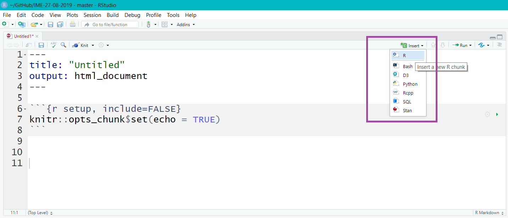
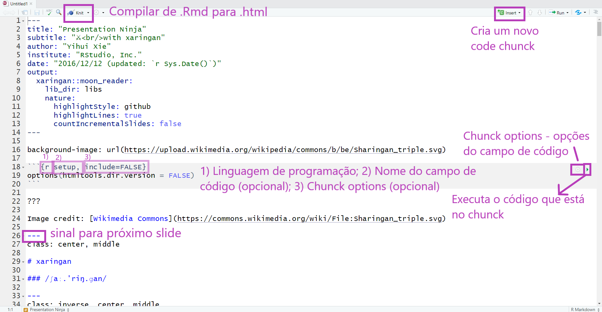

```{r setup, include=FALSE}
options(htmltools.dir.version = FALSE)

knitr::opts_chunk$set(
  echo = FALSE,
  fig.align = "center",
  message = FALSE,
  warning = FALSE,
  cache = TRUE
)
```

```{r}
library(tidyverse)
```

```{r eval=FALSE, include=FALSE}

write_delim(x = mtcars,
            path = "~/GitHub/aMostra-IME-2019-Xaringan/data/mtcars.csv")
```


# Beatriz Milz
- Doutoranda no Programa de Pós-Graduação em Ciência Ambiental (PROCAM) - Instituto de Energia e Ambiente - Universidade de São Paulo

  - Bolsista FAPESP - Processo nº 2018/23771-6 
  
  - Projeto Temático FAPESP Macroamb - Processo nº 2015/03804-9 
  
```{r, out.width="80%"}
knitr::include_graphics("img/logos_bia.png")
```

- Equipe da Secretaria Executiva  Editorial - [Revista Ambiente & Sociedade](http://scielo.br/asoc)

- Co-organizadora - [R-Ladies São Paulo](https://www.meetup.com/pt-BR/R-Ladies-Sao-Paulo) `r emo::ji("purple_heart")`

- [Currículo disponível neste link](https://beatrizmilz.github.io/resume/index.pdf)

- Anteriormente:
  - Mestre em Ciências - UNIFESP
  - Bacharel em Gestão Ambiental - EACH/USP

---
class: 

# Mariana Dias Guilardi

- Mestranda no Programa Interunidades em Biotecnologia - Universidade de São Paulo/Instituto Butantan/Instituto Pesquisas Tecnológicas

  - Bolsista CAPES
 
- Participante do [R-Ladies São Paulo](https://www.meetup.com/pt-BR/R-Ladies-Sao-Paulo) desde novembro de 2018 `r emo::ji("purple_heart")`

- Participante do [PyLadies São Paulo](https://www.facebook.com/PyLadiesSP) desde julho de 2018 `r emo::ji("red_heart")`
  - [Grupo de Estudos em Data Science (GEDS)](https://github.com/PyLadiesSP/data-science)

- [Currículo disponível neste link](https://bit.ly/2QPS4Rr) 

- Anteriormente:
  - Especialista em Animais de Interesse em Saúde - CEFOR/SUS/SP 
  - Bacharel em Ciências Biológicas - UFSCar _campus_ Sorocaba `r emo::ji("woman_scientist_medium_dark_skin_tone")` `r emo::ji("dna")`
  
---
class: 

```{r, out.width="15%", fig.cap="<center><b>Logo - R-Ladies </center></b>"}
knitr::include_graphics("img/hexlogorladies.jpeg")
```

- R-Ladies é uma organização mundial que **promove a diversidade de gênero** na comunidade da linguagem R.

- R-Ladies São Paulo integra, orgulhosamente, a organização R-Ladies Global, em São Paulo. 

--

- [Código de conduta - R-Ladies](https://github.com/rladies/starter-kit/wiki/Code-of-Conduct#portuguese)

--

- Saiba mais:
  - Website RLadies Global: [https://rladies.org/](https://rladies.org/)
  - Twitter: [@RLadiesGlobal](https://twitter.com/rladiesglobal), [@RLadiesSaoPaulo](https://twitter.com/RLadiesSaoPaulo)
  - Instagram: [@RLadiesSaoPaulo](http://instagram.com/RLadiesSaoPaulo)
  - Facebook: [@RLadiesSaoPaulo](http://facebook.com/RLadiesSaoPaulo)
  - MeetUp: [https://www.meetup.com/pt-BR/R-Ladies-Sao-Paulo](https://www.meetup.com/pt-BR/R-Ladies-Sao-Paulo)
  - Github: [https://github.com/rladies/meetup-presentations_sao-paulo](https://github.com/rladies/meetup-presentations_sao-paulo)

---

class: middle

# Pré-requisitos

## R
- Download em: https://cran.r-project.org/

## RStudio
- Download em: https://www.rstudio.com/products/rstudio/download/

## Download do seguinte repositório para exercícios:
https://github.com/beatrizmilz/aMostra-IME-2019-Xaringan

---
class: middle

# Pacote rmarkdown

```{r, out.width="25%", fig.cap="<center><b>Logo: <a href='https://rmarkdown.rstudio.com'>Pacote Rmarkdown</a></b></center>"}
knitr::include_graphics("img/rlogos/hex-rmarkdown.png")
```

- Mantido pela [RStudio](https://rstudio.com/)

- extensão `.Rmd`

- Possibilita a utilização de códigos `R`, `Markdown`, `HTML` e outros.

---
class: middle

# Pacote rmarkdown

```{r, out.width="60%", fig.cap="<center><b>Fonte: <a href='https://rmarkdown.rstudio.com'>Pacote Rmarkdown</a></b></center>"}
knitr::include_graphics("img/markdown.png")
```


---
class: middle

# Pacote xaringan

```{r, out.width="30%", fig.cap="<center><b>Logo: <a href='https://github.com/yihui/xaringan'>Pacote xaringan</a></b></center>"}
knitr::include_graphics("img/rlogos/hex-xaringan.png")
```

- Possibilita criar apresentações **ninja** com `RMarkdown`

- Utiliza a biblioteca `remark.js`

- Resultado em HTML (mas também PDF - estático)


---
class: middle

# Como usar o xaringan?

- Instalar o pacote:

```{r echo=TRUE, eval=FALSE}
install.packages("xaringan")
```

- Confira se o pacote está instalado:
```{r echo=TRUE, eval=FALSE}
library(xaringan)
```

---
class: middle

## Crie um novo projeto (Rproj)


  - File > New Project
  
  - Post da [Curso-R](https://www.curso-r.com) sobre [RProj e diretórios](https://www.curso-r.com/blog/2019-07-16-zen-do-r-3/)

---
class: middle

## Criar um arquivo rmarkdown, com template Ninja Presentation

  - File > New File > R Markdown...
  
  - New RMarkdown > From Template > Ninja presentation
  
```{r, out.width="50%"}
knitr::include_graphics("img/criar-xaringan.JPG")
```

---
class: middle

## Estrutura arquivo rmarkdown

```{r, out.width="90%"}
knitr::include_graphics("img/rmd-estrutura.png")
```

---
class: middle

## Exercício
.pull-left[
```{r, out.width="90%"}
knitr::include_graphics("https://media3.giphy.com/media/VbnUQpnihPSIgIXuZv/giphy-downsized.gif")
```
]

.pull-right[

- Criar um novo RProj 

  - File > New Project

- Criar um arquivo:

  - File > New File > R Markdown...
  
  - New RMarkdown > From Template > Ninja presentation

- Observe a estrutura do documento  

- Apagar todo o conteúdo após o código `yaml`
  
]


---
class: middle

## Compilar para html

```{r, out.width="90%"}
knitr::include_graphics("img/knit-button.png")
```


---

## Alterar yaml

- O `yaml` possui informações importantes para a apresentação, como o título, subtítulo, autor, instituição, data, etc.

- __output:__ formato (Ex: html_document, pdf_document, etc). No caso do  `xaringan` , o output é `xaringan::moon_reader`

- __libs_dir:__ pasta onde colocará bibliotecas necessárias (ex. remark-latest.min.js)

- Cuidado com a identação!

```{r}
knitr::include_graphics("https://media0.giphy.com/media/xT9IgIc0lryrxvqVGM/giphy-downsized.gif")
``` 

---
class: middle
## ERRO NO KNITR!

- Boa prática: compilar com frequência. 

- É bem comum dar erro ao compilar o arquivo pois **qualquer** código errado causa isso. Algumas coisas pra se observar:

- **yaml header** - se algo estiver errado, vai dar erro ao compilar. 
Muito cuidado com a identação!

- **Código nos chunks** - teste o _Run All Chunks_ e veja se aparece erro em algum chunk específico.
Se descobrir, tente verificar o que há de errado no código (pode ser a falta de um parênteses, vírgula, entre outros).

```{r echo=FALSE, out.width="30%"}
knitr::include_graphics("https://media.giphy.com/media/j9GASQ5ocrIRicnmyq/giphy.gif")
```

---
class: middle

## Exercício
.pull-left[
```{r, out.width="90%"}
knitr::include_graphics("https://media0.giphy.com/media/JIX9t2j0ZTN9S/giphy-downsized.gif")
```
]

.pull-right[

- Na pasta `exercicios/`, Salve o arquivo como `exercicio0.Rmd`

- Compile (botão `knit`)

- Veja o arquivo (caso não abra automaticamente, procure o arquivo `exercicio0.html` na pasta `exercicios/` do projeto)

- Mude as seguintes informações no yaml: title, subtitle, author, institute, date

- Compile novamente. O que mudou?
  
]

---
### Exemplo do código yaml:

```{r echo=TRUE, eval=FALSE}
---
{{title: "Título da apresentação"}}
{{subtitle: "Subtítulo da apresentação"}}
{{author: "Autor"}}
{{institute: "Instituição"}}
{{date: "07/09/2019"}}
output:
  xaringan::moon_reader:
    lib_dir: libs
    nature:
      highlightStyle: github
      highlightLines: true
      countIncrementalSlides: false
---
```

- Aperte H ou ? para conferir a lista de atalhos do  `xaringan` 
---
class: middle

## Organizando a pasta

- `img/` - imagens, figuras, etc.

- `libs/` - bibliotecas. 

- `css/` - opcional. Arquivos `.css`.


---
class: middle

## Configurações no yaml

### Encoding

- Adicionar no yaml:

```{r echo=TRUE, eval=FALSE}
encoding: "UTF-8"
```


---
class: 

## Configurações no yaml

### Biblioteca `remark.js`

- É opcional. Essa etapa possibilita que sua apresentação seja visualizada offline!


- Fazer download da biblioteca `remark.js`. Duas opções:
  - A função `xaringan::summon_remark()` faz o download da versão mais atual do `remark.js` e salva na pasta `/libs`. 
  
```{r echo=TRUE, eval=FALSE}
xaringan::summon_remark()
```

- Ou: 
```{r echo=TRUE, eval=FALSE}
download.file("https://remarkjs.com/downloads/remark-latest.min.js",
              destfile = "libs/remark-latest.min.js")
```
--
- Adicionar no yaml:

```{r echo=TRUE, eval=FALSE}
output:
  xaringan::moon_reader:
{{    chakra: libs/remark-latest.min.js  }}
    lib_dir: libs
```


---
class: middle

## Configurações no yaml
### Tema

- Depende da versão do `xaringan` que está usando.

- Para consultar os temas disponíveis:
  
```{r echo=TRUE}
names(xaringan:::list_css())
```


---

## Configurações no yaml
### Tema


- Usar em dupla: `nomedotema` e `nomedotema-fonts`

- Adicionar no yaml:

```{r echo=TRUE, eval=FALSE}
output:
  xaringan::moon_reader:
{{    css: ["rladies", "rladies-fonts"]}}
```

---

### Exemplo do código yaml:

```{r echo=TRUE, eval=FALSE}
---
title: "Título da apresentação"
subtitle: "Subtítulo da apresentação"
author: "Autor"
institute: "Instituição"
date: "07/09/2019"
{{encoding: "UTF-8"}}
output:
  xaringan::moon_reader:
{{   chakra: libs/remark-latest.min.js  }}
{{   css: ["rladies", "rladies-fonts"]}}
    lib_dir: libs
    nature:
      highlightStyle: github
      highlightLines: true
      countIncrementalSlides: false
---
```

---
class: middle

## Exercício 
### `exercicios/exercicio1.Rmd`

.pull-left[
```{r, out.width="90%"}
knitr::include_graphics("https://media1.giphy.com/media/mCRJDo24UvJMA/giphy.gif")
```
]

.pull-right[

- Adicione no yaml: 
    - encoding, 
    - tema 
    - biblioteca remark.js 


- Compile o arquivo. O que mudou?
  
]

---
# Adicionando conteúdo na apresentação

- Atualiza a apresentação enquanto é editada:

```{r echo=TRUE, eval=FALSE}
xaringan::inf_mr()
```


## Markdown

- O RMarkdown possibilita a utilização da linguagem de marcação simples Markdown. Essa linguagem de marcação foi elaborada para ser fácil de ler e  fácil de escrever.

* Confira as cheatsheets: [Rmarkdown Cheatsheet 2.0](http://www.rstudio.com/wp-content/uploads/2016/03/rmarkdown-cheatsheet-2.0.pdf) e [Rmarkdown Cheatsheet](https://www.rstudio.com/wp-content/uploads/2015/02/rmarkdown-cheatsheet.pdf).


---
### Elementos básicos 

`**negrito**` - **negrito**

`_itálico_` - _itálico_

`~~riscado~~` - ~~riscado~~ 
---
### Títulos

`# Título 1`
# Título 1

`## Título 2`
## Título 2

`### Título 3`
### Título 3

---
### Listas

Você pode fazer uma lista escrevendo com hifens ou asteriscos, como a seguir:

`* Maçã`

`* Banana`

`* Uva`

ou desta forma:

`- Maçã`

`- Banana`

`- Uva`

Cada um vai aparecer como:

- Maçã
- Banana
- Uva

---
### Fazendo uma lista enumerada
Você pode fazer uma lista numerada usando somente números. Você pode usar o mesmo número quantas vezes quiser: 

`1. Maçã`

`1. Banana`

`1. Uva`

Isso irá aparecer como:

1. Maçã
1. Banana
1. Uva

---
### Outros elementos em markdown

- Você pode fazer um hiperlink dessa forma: `[texto para mostrar](http://the-web-page.com)`.

- Você pode incluir arquivo de imagem dessa forma: ``

- Se você utiliza equações em LaTeX, ficará feliz em saber que pode usar `$$` para inserir equações matemáticas, como: 

```{r, echo=TRUE, eval=FALSE}
$$y = \mu + \sum_{i=1}^p \beta_i x_i + \epsilon$$
```

$$y = \mu + \sum_{i=1}^p \beta_i x_i + \epsilon$$

---
class: middle

## Exercício
### `exercicios/exercicio2.Rmd`
.pull-left[
- Abra a cheatsheet do RMarkdown.

- Reproduza a seguinte formatação no arquivo de exercício:

- Compile e veja o resultado
]

.pull-right[

# xaringan

O **pacote** `xaringan` foi criado por [Yihui Xie](https://yihui.name/), que é ~~um ninja~~ desenvolvedor de software na *RStudio*.

]
---
class: middle

## Como delimitar slides?

- No xaringan, os slides são delimitados por `---` no início da linha.

- Para fazer slides que aparecem aos poucos ( _incremental slides_ ), utilize `--` no início da linha. Ex:

--

O conteúdo 
--

aparece 
--

aos poucos!


---

## Chunks de Código R

Os chunks são campos onde podemos inserir código de R (ou Python, SQL,  Bash...) em um arquivo RMarkdown. Existe um atalho do teclado para criar chunks no RStudio:  `Ctrl + ALt + I`. Também é possível criar um chunk clicando no seguinte botão do RStudio:


```{r echo=FALSE, out.width="90%"}

```

---
### Exemplo:

```{r echo=TRUE}
summary(mtcars)
```
---
### Exemplo:

.left-code[
```{r plot-exemplo-ggplot2, echo=TRUE, fig.show="hide", out.width="95%"}
library(ggplot2)
ggplot(mtcars) +
  aes(x = hp,
      y = mpg,
      colour = cyl) +
  geom_point(size = 2L)
```
]

.right-plot[
`)
]

---
class: middle

### `exercicios/exercicio3.Rmd`
.pull-left[
```{r, out.width="90%"}
knitr::include_graphics("https://media3.giphy.com/media/VbnUQpnihPSIgIXuZv/giphy-downsized.gif")
```
]

.pull-right[
- Use `--- ` para separar o conteúdo em slides
- Deixamos o código para fazer o download e carregar a base de [capítulos da R-Ladies](https://benubah.github.io/r-community-explorer/data/rladies.csv). Fonte: [Shiny - R Community Explorer](https://benubah.github.io/r-community-explorer/rladies.html)

- Adicione um chunk para as seguintes tarefas:

  - Quantos capítulos estão cadastrados nessa base?
  - No total, quantos membros a R-Ladies tem?
  - Faça algum gráfico com os dados dessa base. Ex: histograma com a frequência de membros.

]


---
### Opções de Chunk

- Há uma variedade de opções de chunk que podem afetar como os chunks de código são compilados. Exemplos: 

- `echo=FALSE`- evita que o próprio código apareça

- `eval=FALSE` - mostra o código, mas ele não é executado

- `warning=FALSE` e `message=FALSE` - oculta mensagens de avisos produzidas

- `out.width` - controla o a largura das figuras, gráficos, tabelas geradas (Ex: out.width = "100%")

- Ex de configuração do chunk: `{r, warning=FALSE, message=FALSE}`


---
## Códigos em R - Opções de chunk

.pull-left[
### Código + Resultado
- `echo=TRUE`
```{r echo=TRUE}
nrow(mtcars)
```
]

.pull-right[

### Apenas código
- `echo=TRUE, eval=FALSE`
```{r echo=TRUE, eval=FALSE}
nrow(mtcars)
```

### Apenas resultado
- `echo=FALSE`
```{r echo=FALSE}
nrow(mtcars)
```

]

---
## Código inline

A base mtcars possui `r nrow(mtcars)` carros.

**Código Markdown:**

```{r echo=TRUE}
#   A base mtcars possui `r nrow(mtcars)` carros.
```


---
### Opções globais de Chunk

As opções globais de chunk são opções de chunk que são válidas para o documento inteiro. Algumas opções são úteis, como `fig.align = "center"`.
Para configurar as opções globais de chunk, modifique o código abaixo e insira após o código `yaml` (retire os `#` no início de cada linha):

- Ex:
  - Configurações do chunk:
`{r setup, include=FALSE}`
  - Conteúdo do chunk:
`knitr::opts_chunk$set(...)`


---

## Dicas - RStudio
```{r echo=FALSE, out.width="100%"}

```


---
class: middle

### `exercicios/exercicio4.Rmd`
.pull-left[
```{r, out.width="90%"}
knitr::include_graphics("https://media3.giphy.com/media/VbnUQpnihPSIgIXuZv/giphy-downsized.gif")
```
]

.pull-right[

- Altere os chunks criados anteriormente: 
  - No chunk que carrega a base, utilize as opções `message` e `warning` para que não apareça mensagens de aviso.
  - No chunk que gera um gráfico, adicione a opção `out.width` para que o gráfico gerado fique inteiramente dentro do slide.
  - Utilize os códigos utilizados anteriormente e o que aprendeu sobre inline code para escrever o seguinte texto: "A organização R-Ladies atualmente apresenta X capítulos, e um total de Y participantes".

]


---
### Adicionando imagens usando o `knitr`

Função: `knitr::include_graphics()`

Exemplo:
```{r  out.width = "50%"}
knitr::include_graphics("https://www.r-project.org/Rlogo.png")
```
---
### Adicionando imagens usando `knitr`: opções de Chunk 

- `out.width = "50%"` - tamanho da imagem


```{r echo=FALSE, out.width = "50%"}
knitr::include_graphics("https://www.r-project.org/Rlogo.png")
```

[Opções do KnitR](https://yihui.name/knitr/options/#chunk-options)

---
### Adicionando imagens usando `knitr`: opções de Chunk 

- **Alinhamento da figura**
- `fig.align = 'center', 'default', **'left'**,'right'` 

```{r echo=FALSE,  out.width="20%", fig.align='left'} 
knitr::include_graphics("https://www.r-project.org/Rlogo.png")
```

- `fig.align = 'center', 'default', 'left', **'right' **`

```{r echo=FALSE,  out.width="20%", fig.align='right'}
knitr::include_graphics("https://www.r-project.org/Rlogo.png")
```
---
### Adicionando imagens usando `knitr`: opções de Chunk 

- Legenda de figura 

- `fig.cap="Logo R"`


```{r echo=FALSE,  out.width="50%", fig.cap="R Logo", fig.align='center'}
knitr::include_graphics("https://www.r-project.org/Rlogo.png")
```

---
class: middle

### `exercicios/exercicio5.Rmd`
.pull-left[
```{r, out.width="90%"}
knitr::include_graphics("https://media3.giphy.com/media/VbnUQpnihPSIgIXuZv/giphy-downsized.gif")
```
]

.pull-right[
- Utilize a opção de chunk `fig.align` para centralizar o gráfico gerado.
- Adicione a imagem do logo do pacote xaringan utilizando a função `knitr::include_graphics`.

- Utilizando as opções de chunk: 
  - Centralize essa imagem;
  - Não deixe o código visível
  - Adicione uma legenda.

]

---
### Adicionando tabelas 

- Markdown
- `knitr::kable()`
- `DT::datatable(iris)`

- Exemplo com knitr:
```{r echo=TRUE}
knitr::kable(x = head(iris), format = "html")
```


---
class: middle

### `exercicios/exercicio6.Rmd`
.pull-left[
```{r, out.width="90%"}
knitr::include_graphics("https://media3.giphy.com/media/VbnUQpnihPSIgIXuZv/giphy-downsized.gif")
```
]

.pull-right[
- Deixamos um código que gera a base `rladies_br`, contendo apenas capítulos no Brasil.
]
---
Class: middle

# Vantagens e desvantagens

.pull-left[
`r emo::ji("+1")` É reprodutível.

`r emo::ji("+1")` Dá para facilmente inserir equações em LaTeX.

`r emo::ji("+1")` Usar códigos R e seus resultados.

`r emo::ji("+1")` É possível utilizar o versionamento de código utilizando `Git` e `GitHub`.

`r emo::ji("+1")` Possibilita o desenvolvimento do material em equipe (através do GitHub).

`r emo::ji("+1")` Disponibilizando online e enviando o link, é possível atualizar o conteúdo em qualquer momento.
]

.pull-right[

`r emo::ji("-1")` Em formato HTML, não é autocontido (possui dependências).

`r emo::ji("-1")` Para personalizar visualmente a apresentação, caso não tenha um tema que agrade, precisa personalizar utilizando CSS.

`r emo::ji("-1")` Encontrar erros..  `r emo::ji("sob")`
]
<!-------------FINALIZANDO A APRESENTAÇÃO----------->

---
## Dicas:
- Pacote [remedy](https://github.com/ThinkR-open/remedy) - Addin que facilita o uso de markdown
- Pacote [emo](https://github.com/hadley/emo) - Usar emoticons
- Pacote [ermoji](https://github.com/gadenbuie/ermoji) - Addin que facilita encontrar os emojis
- Pacote [giphyr](https://github.com/haozhu233/giphyr) - Addin que facilita encontrar gifs
- Pacote [xaringan themer](https://www.garrickadenbuie.com/project/xaringanthemer/) - Pacote que facilita personalizar o tema
- Pacote [kableExtra](http://haozhu233.github.io/kableExtra/) - disponibiliza mais funcionalidades para criar tabelas

### Converter a apresentação em PDF
- Pacote `pagedown` oferece uma função para isso:
```{r echo=TRUE, eval=FALSE}
remotes::install_github('rstudio/pagedown')
pagedown::chrome_print("index.html")
```


### Divulgando online
- [GitHub Pages](https://pages.github.com/)
- [Netlify](https://www.netlify.com/)

---
## Outras apresentações

- https://beatrizmilz.github.io/IME-27-08-2019/

- https://beatrizmilz.github.io/IV-SER-RLadies/


---
class: middle

# Referências

- **RMarkdown**:
  - [RMarkdown Cheatsheet](https://www.rstudio.com/wp-content/uploads/2015/02/rmarkdown-cheatsheet.pdf)
  
  - [R Markdown from RStudio](https://rmarkdown.rstudio.com/lesson-1.html)
  
  - [R Markdown: The Definitive Guide](https://bookdown.org/yihui/rmarkdown/)
  
  - [R for Data Science - Cap 27: R Markdown](https://r4ds.had.co.nz/r-markdown.html)
  
  - [Software Carpentry - Producing Reports With knitr ](https://swcarpentry.github.io/r-novice-gapminder/15-knitr-markdown/)

  - [Advanced R Markdown](https://slides.yihui.name/2017-rstudio-conf-rmarkdown-Yihui-Xie.html)

- **Xaringan**:

  - [Apresentação da documentação](http://slides.yihui.name/xaringan/) 

  - [Xaringan Wiki](https://github.com/yihui/xaringan/wiki)
  
  - [Livro R Markdown (Capítulo 7)](https://bookdown.org/yihui/rmarkdown/xaringan.html)

  - [Remark.js Wiki](https://github.com/gnab/remark/wiki)


---
class: middle  

# Agradecimentos


```{r, out.width="40%"}
knitr::include_graphics("https://media1.giphy.com/media/3oz8xIsloV7zOmt81G/giphy.gif")
```


- Yihui Xie - Pelo pacotes, livros, blogposts, vídeos
- [Bruna Wundervald](http://brunaw.com/) e [Haydee Svab](https://www.linkedin.com/in/hsvab/) - Por ajudar em versões anteriores da apresentação
- [Julio Trecenti](https://github.com/jtrecenti), [Curso-R](https://www.curso-r.com/) e [13 aMostra de Estatística](https://www.ime.usp.br/~amostra/) - IME USP pelo mini-curso de RMarkdown em 2018


- Apresentação feita com [ `xaringan` ](https://github.com/yihui/xaringan).
